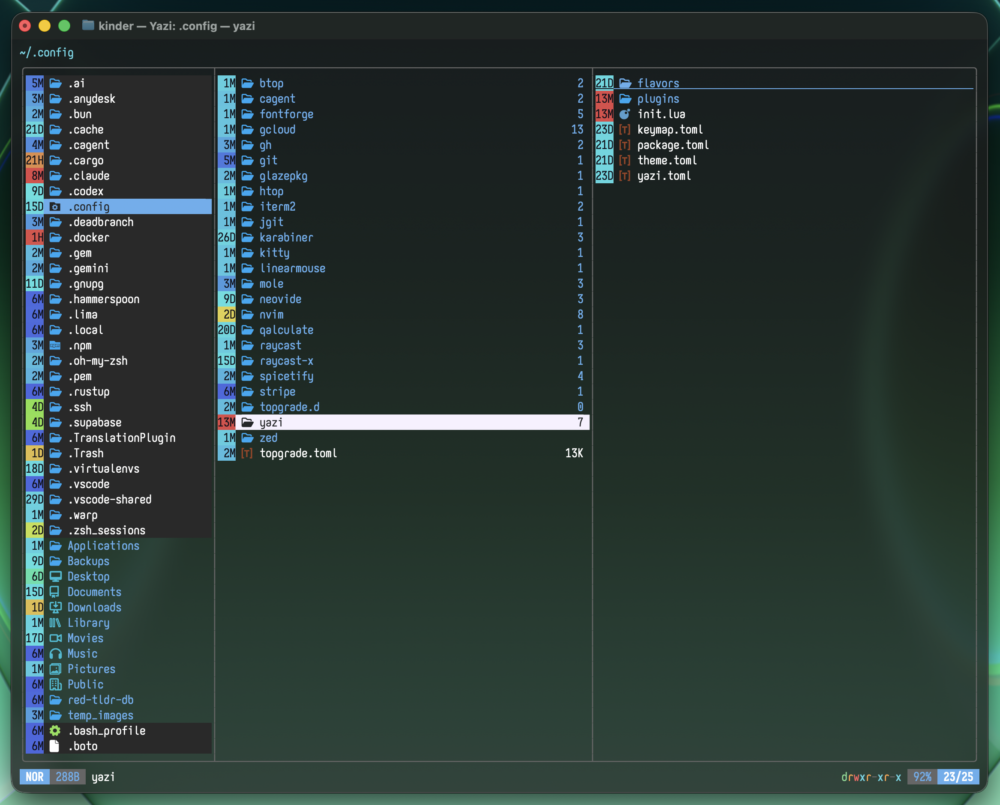

# age-badge.yazi

A [Yazi](https://github.com/sxyazi/yazi) plugin that adds a small colored chip next to every file showing how long ago it was modified. The chip's color runs from **red** (just modified) through the spectrum to **violet** (long ago), inspired by the age column in [OneCommander](https://www.onecommander.com/).

The label is always a single uppercase unit letter with at most two digits, so the badge stays a fixed width and never disturbs alignment.

## Preview



## Requirements

- Yazi `>= 0.3.0` (the `Entity:children_add` / `Linemode:children_add` API; tested on `26.5.6`)

## Installation

```sh
ya pkg add alchezar/age-badge
```

Or install manually by cloning into your plugins directory:

```sh
git clone https://github.com/alchezar/age-badge.yazi.git ~/.config/yazi/plugins/age-badge.yazi
```

## Usage

Add this to your `~/.config/yazi/init.lua`:

```lua
require("age-badge"):setup()
```

## Configuration

`setup()` accepts an optional table:

```lua
require("age-badge"):setup {
  position = "left", -- "left" (default) or "right"
  pad      = false,  -- add a blank cell on the outer side
  compact  = true,   -- true (default) = 3 cells, false = roomier 5 cells
}
```

| Option     | Values                     | Description                                                                   |
| ---------- | -------------------------- | ----------------------------------------------------------------------------- |
| `position` | `"left"` (default)         | Before the icon and name (via `Entity`).                                      |
|            | `"right"`                  | After the size, on the right (via `Linemode`).                                |
| `pad`      | `false` (default) / `true` | Blank cell on the badge's outer edge: left for `"left"`, right for `"right"`. |
| `compact`  | `true` (default) / `false` | `true` is a snug 3-cell chip; `false` widens it to 5 cells.                   |

## How it works

The chip color is derived from the file's modification time (`cha.mtime`) compared to the current time. Hue is mapped across fixed time bands so recent files get most of the resolution:

| Age             | Color                             |
| --------------- | --------------------------------- |
| up to 1 day     | red -> orange                     |
| 1 - 8 days      | orange -> yellow -> green -> cyan |
| 8 days - 1 year | cyan -> blue -> violet            |
| over 1 year     | violet -> magenta                 |

The label uses one letter per unit, capped at two digits:

| Letter | Unit    | Range |
| ------ | ------- | ----- |
| `S`    | seconds | 0-59  |
| `M`    | minutes | 1-59  |
| `H`    | hours   | 1-23  |
| `D`    | days    | 1-60  |
| `M`    | months  | 2-12  |
| `Y`    | years   | 1-99  |

Minutes and months share the letter `M`, but they are never confused because their colors differ (orange vs. blue).

> **Note on folders:** `cha.mtime` for a directory reflects when an entry was last added, removed, or renamed directly inside it - not the newest file anywhere in the tree, and not when the folder itself was renamed.

## Credits

The idea of a color-coded file-age column comes from [OneCommander](https://onecommander.com/).

## License

[MIT](LICENSE)
